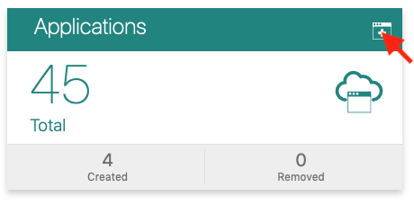
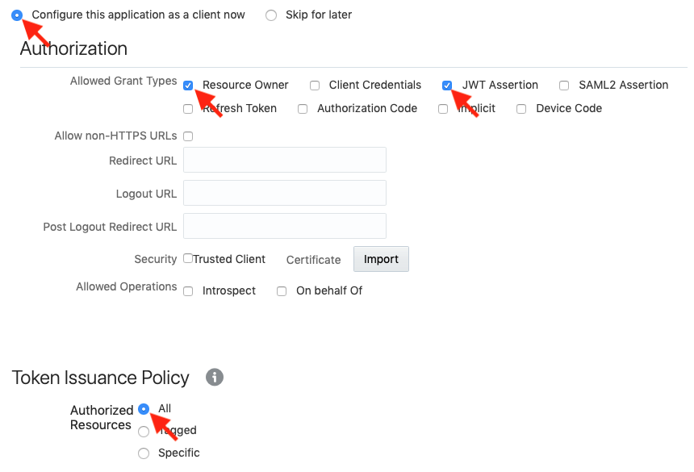
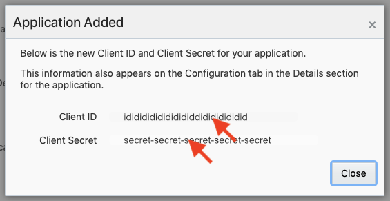
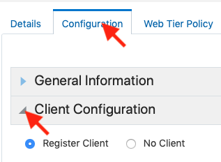
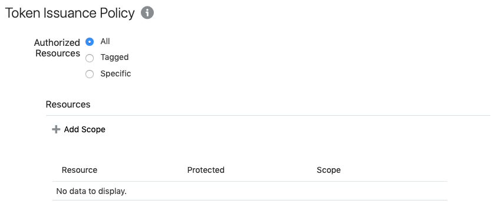
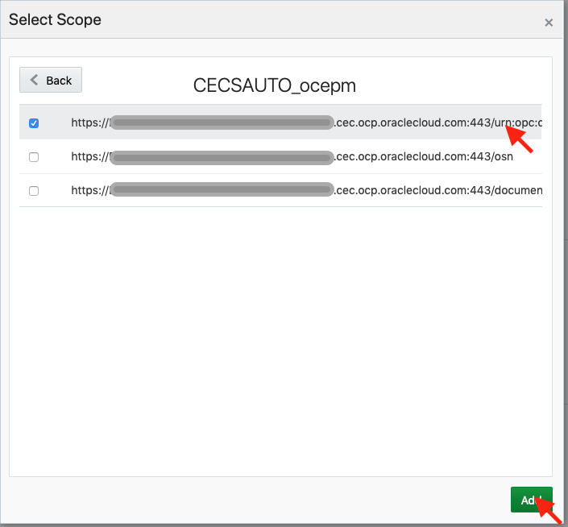

# Setup for CLI to use IDCS App for connection instead of Headless Chrome
Content Toolkit supports connection via IDCS app, which removes the need to pop up Chromium to authenticate.
The following instructions detail how the IDCS app can be created and registered for use with the Content Toolkit CLI.

## Access your MyServices Dashboard
Go to your MyServices Dashboard - the URL will be like this:

[https://myservices-oce1234.console.oraclecloud.com/mycloud/cloudportal/dashboard](https://myservices-oce1234.console.oraclecloud.com/mycloud/cloudportal/dashboard)  

Click **Identity Cloud** link


Copy the **Service Instance URL** for later, and then click on the **Service Instance URL** link

Your **Service Instance URL** will be like: https://idcs-1234123412341234123412341234.identity.oraclecloud.com


Click on the **Applications** tile to create a new Application



Pick a **Confidential Application**


Name the application - e.g. oce-toolkit


Click **Next** and choose option: **Configure this application as a client now**.  Select '**Resource Owner**' and '**JWT Assertion**'
Select: Authorized Resources:  **All**



Click **Next** to Resource tab, do nothing
Click **Next** to Web Tier Policy, do nothing
Click **Next** to Authorization, do nothing
Click **FINISH**

Copy down the **Client ID** and **Client Secret**

They will be like:
**Client ID**: idididididididididididididid
**Client Secret**: secret-secret-secret-secret-secret



Go back to the **Configuration** tab and expand **Client Configuration**



Scroll down to the **Token Issuance Policy** section and click **+ Add Scope**



In the **Select Scope** Dialog, find your CEC Instance and click the **>** button.


Select the scope that has the url with **/urn:opc:...** and then click **Add**



Copy down the **Scope** URL, it will be something like this:

[https://SCOPESCOPESCOPESCOPE.cec.ocp.oraclecloud.com:443/urn:opc:cec:all](https://SCOPESCOPESCOPESCOPE.cec.ocp.oraclecloud.com:443/urn:opc:cec:all)


Click **Save** and Click **Activate**

# Register your SERVER with the Content Toolkit CLI

You will need your:

* **OCM Instance URL**: e.g. https://ocepm-oce1234.cec.ocp.oraclecloud.com
* **Username and Password** for your OCM Instance URL
* **Identity Service Instance URL**: e.g: https://idcs-1234123412341234123412341234.identity.oraclecloud.com
* **Client ID**: idididididididididididididid
* **Client Secret**: secret-secret-secret-secret-secret
* **Scope URL**:  e.g: https://SCOPESCOPESCOPESCOPE.cec.ocp.oraclecloud.com:443/urn:opc:cec:all

```
$ cd your-cec-directory
$
$ cec register-server NAME --endpoint https://ocepm-oce1234.cec.ocp.oraclecloud.com -u username -p 'password' --idcsurl https://idcs-1234123412341234123412341234.identity.oraclecloud.com --clientid idididididididididididididid --clientsecret secret-secret-secret-secret-secret --scope https://SCOPESCOPESCOPESCOPE.cec.ocp.oraclecloud.com:443/urn:opc:cec:all
```


Test your connection

```
$ cec list --server NAME
``` 
